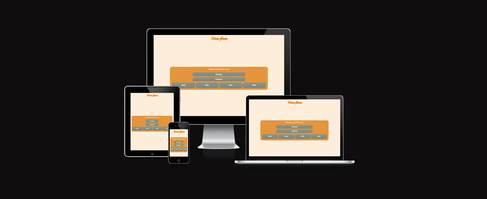
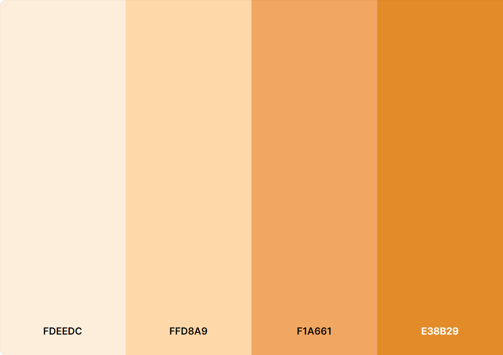

# Trivia Game

This is a simple trivia game for anyone who wants to test their knowledge under the following four categories, Movies, Games, TV Shows and Sports. The main purpose of this site is to test users knowledge of various different categories.

The website can be viewed here. [Trivia Game](https://shanecdev.github.io/quiz/)

# Index - Table of Contents

- [User Experience (UX)](https://github.com/ShaneCDev/quiz#user-experience-ux)
- [Features](https://github.com/ShaneCDev/quiz#features)
- [Future Implementations](https://github.com/ShaneCDev/quiz#future-implementations)
- [Technologies Used](https://github.com/ShaneCDev/quiz#technologies-used)
- [Testing](https://github.com/ShaneCDev/quiz#testing)
- [Deployment](https://github.com/ShaneCDev/quiz#deployment)
- [Credits](https://github.com/ShaneCDev/quiz#credits)
- [Acknowledgments](https://github.com/ShaneCDev/quiz#acknowledgments)

# User Experience (UX)

## User Stories

- ## As a website owner I want:
1. The website to read in a random quiz everytime so all the answers are not always the same.
2. The website to track the users score and store it in a leaderboard.
3. The website provides users a place to come and test their knowledge.

- ## As a website user I want:
1. To easily understand the purpose of the site.
2. To be able to track my score and see where I rank among other users.
3. To test my knowledge of Movies, Games, TV Shows and Sports.

- As a Returning Website User I want:
1. The quiz to be different so that the answers ain't the same.

# 1. Strategy
- The main purpose for creating this website is to provide users with a place to test their knowledge.

# 2. Scope
- The multipage design is relatively simple and the quiz and how to play is provided to the user clearly and concisely.
- The information and quiz can be accessed and played on all devices.

# 3. Structure
- Users will find themselves on the homepage where they will met with 6 buttons.
- The 6 buttons are, "How to play", "Leaderboard", "Movies", Games", "Shows", and "Sports".
- The "How to play" button when clicked will show a popup that will explain the rules and how to play.
- The "Leaderboard" button when clicked will take you to the leaderboard page where you can see where you rank among others.
- When either of the other four buttons are clicked they will take you to the quiz page and will display questions and answers based on what was clicked, so for example if the user clicks the "Movies" button they will be brought to a page that will display movie questions and answers.

# 4. Skeleton
## Wireframes
The wireframes were made using Balsamiq.
- [Home](/assets/img/wireframes/index.png)
- [Quiz](/assets/img/wireframes/quiz.png)
- [End](/assets/img/wireframes/end.png)
- [Leaderboard](/assets/img/wireframes/leaderboard.png)

# 5. Surface
- ## Colour

The colour palette is based on another idea I had for a website.

- ## Fonts
'Yellowtail' and 'Lato' are the fonts used for this website and have been imported from Google fonts.

# Features
## Existing Features
This website is compromised of a home page, quiz page, end page and finally a leaderboard page.

All pages on the site are responsive and have:
- A favicon in the browser tab.

- The name of the site is located at the top of the page and it also acts as a link back to the home page.

## The Home page
The home page displays the site name as a title and then a container that holds 6 buttons, including a how to play button so users know how to play the game. Also users can go back to the home page at anytime by clicking the title at the top of the screen as it also acts as a link back to index.html.

The how to play button opens up a modal that shows the user hwo to play the quiz. Inside the modal is a close button which when clicked will close the modal and user can carry on.

Any of the 4 category buttons will take you to the quiz page and the user can answer questions relative to the category they have chosen.

## The Quiz page
When a category is chosen users are met with this page which contains a question, timer, score and question number counter, there are also 5 buttons, 4 of which are answers relative to the question and the 5th button is a next question button which will take the user to the next question only when they have selected an answer first so they can't just click next question over and over as it will not work.

## The End page
Once the user has answered all 10 questions they will be taken to the end page where they will enter their name and save their score and add it to the leaderboard.

The user is unable to click the save score button without entering something into the textfield, if it is their first time playing the quiz they will be met with an alert saying "Score saved" and if its there 2nd or 3rd time playing and they get a better score than previously and are using the same username they will be met with an alert that says "Score updated" see both below.

## The Leaderboard page
The user can come here to see where they rank on the leaderboard.

# Future Implementations

In future implementations of this quiz I would like to:

1. Give the user the option to select the difficulty of the quiz.
2. Give the user the option to choose how many questions in their quiz.
3. Create a backend database to save the scores rather than using local storage.
4. Maybe look into making the quiz multiplayer so that it can be played in teams and I think that could be a lot of fun.

# Technologies Used

- ## Languages 
1. [HTML5](https://en.wikipedia.org/wiki/HTML5)
2. [CSS3](https://en.wikipedia.org/wiki/CSS)
3. [JavaScript](https://en.wikipedia.org/wiki/JavaScript)

- ## Misc Software
- [Google Fonts](https://fonts.google.com/) - To import fonts used on the site.
- [Gitpod](https://gitpod.io/) - IDE used to create the site.
- [Balsamiq](https://balsamiq.com/) - Used to create wireframes.
- [Github](https://github.com/) - To save and store the files for the site.
- [Google Developer Tools](https://developer.chrome.com/docs/) - To troubleshoot and test features and solve issues with responsiveness.
- [Open Trivia Database](https://opentdb.com/) - API used for the quiz.
- [Am I Responsive](http://ami.responsivedesign.is/)

# Testing
- ## HTML Validator
    At various stages HTML Validation was done.
    
- ## CSS Validator
    At various stages CSS Validation was done.
    

- ## JSHint
    At various stages JSHint validation was done.
    

- ## Lighthouse
    At various stages Lighthouse testing was done.

    
    

- ## Solved Bugs

| No | Bug | How I solved the issue |
| :--- | :--- | :--- |
| 1 | The user was able to click the 'Next Question' button without actually selecting an answer. | I added a boolean value which made it so that you could not click the 'Next Question' button without selecting an answer first.
| 2 | I couldn't add the 'wrong-ans' and 'right-ans' classes to whatever button the user clicked. | I was watching a few quiz videos on youtube whilst learning how to go about writing this quiz and came across Web Dev Simplifieds quiz and he went over it in his video so I implemented his solution by returning the answer buttons as a nodelist and then converting them to an array using 'Array.from' I was able to solve the issue.
| 3 | When playing the quiz I have a 'Question No:' counter that should show the relative Question number and when you click the 'Next Question' button that question number increments by 1. But when I got to the last question it was stuck at 9/10 instead of 10/10. | I added a currentQuestionIndex variable and added an if statement which said if currentQuestionIndex = 10 the 'Question No: 10/10'
| 4 | When adding score to the leaderboard if you played the quiz again and used the same username it was adding multiple entries to the leaderboard with the same username instead of updating the score of said user. | I looped through local storage and withing the loop I have an if statement that checks if the username in local storage is equal to the username just entered and whether the local storage score is less than the users most recent score and if it is then I update the record using localStorage.setItem()

- ## Browser Compatability
The website was tested on the following browsers:
- Google Chrome: Version 105.0.5195.127 (Official Build) (64-bit)
- Mozilla Firefox: Version 104.0.2 (64-bit)
- OperaGX: Version 90.0.4480.100

# Deployment & Local Development
## Deployment
The website was deployed using GitHub Pages - [Trivia Game](https://shanecdev.github.io/quiz/index.html)

To deploy the site using GitHub pages: 

1. Go into a repository, click on Settings.
2. Click on GitHub Pages.
3. Click on branches and select "main" from the dropdown.
4. Once "main" is selected, the page will be refreshed automatically and the page will indicate successful deployment and the link will appear.
5. Further changes will be automatically deployed to the live site using the "git push" command from the development environment.

## Local Development

### How to fork

To fork the repository: 

1. Log in (or sign up) to GitHub.
2. Go to the repository for this project, [ShaneCDev/quiz](https://github.com/ShaneCDev/quiz)
3. Click the fork button in the top right corner.

### How to Clone

To clone the repository:

1. Log in (or sign up) to GitHub.
2. Go to the repository for this project, [ShaneCDev/quiz](https://github.com/ShaneCDev/quiz)
3. Click on the code button, select whether you would like to with HTTPS, SSH or GitHub CLI and copy the link shown.
4. Open the terminal in your code editor and change the current working directory to the location you want to use for the cloned directory.
5. Type 'git clone' into the terminal and then paste hte link you copied in step 3. Press enter.

# Credits
- ## Coding
- Some functions of the quiz were built following a tutorial from Web Dev Simplified. [Click here for video](https://www.youtube.com/watch?v=riDzcEQbX6k)
- [Fisher-Yates Shuffle](https://www.geeksforgeeks.org/shuffle-a-given-array-using-fisher-yates-shuffle-algorithm/) used for shuffling the array of answers.
- I used this [video](https://www.youtube.com/watch?v=jfOv18lCMmw&list=PLDlWc9AfQBfZIkdVaOQXi1tizJeNJipEx&index=10) by James Q Quick which taught me how to insert local storage data into my leaderboard page, I had to implement the function differently as he did not account for the user playing the quiz multiple times from what I can see.
- Also used this [video](https://www.youtube.com/watch?v=DFhmNLKwwGw&list=PLDlWc9AfQBfZIkdVaOQXi1tizJeNJipEx&index=9) from James Q Quick whilst researching local storage.
- I used [this](https://www.w3schools.com/howto/howto_css_modals.asp) whilst learning how to make modals.

# Acknowledgments
I would like to thank:
- My mentor Rahul Lakhanpal for his feedback, guidance and support whilst working on this project.
- Slack Community especially Dave Horrucks the man is a hero.